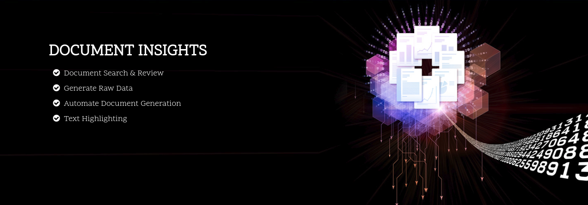
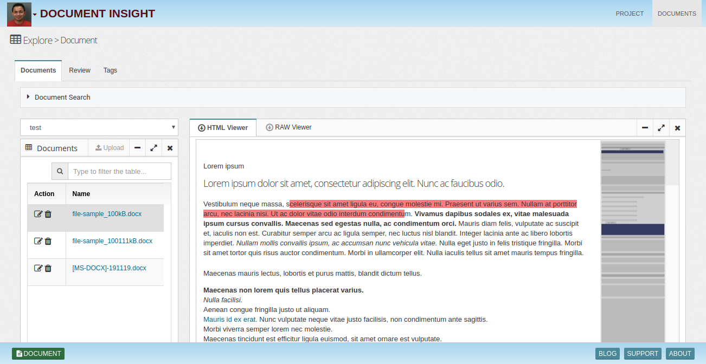
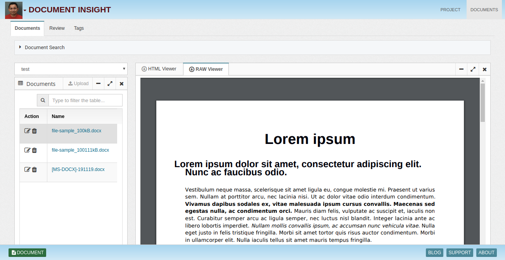
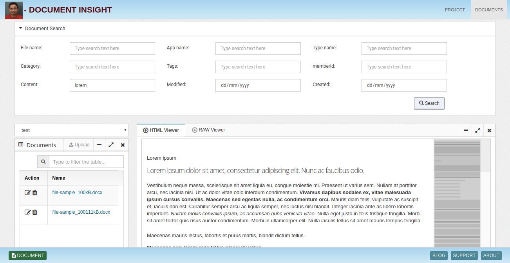
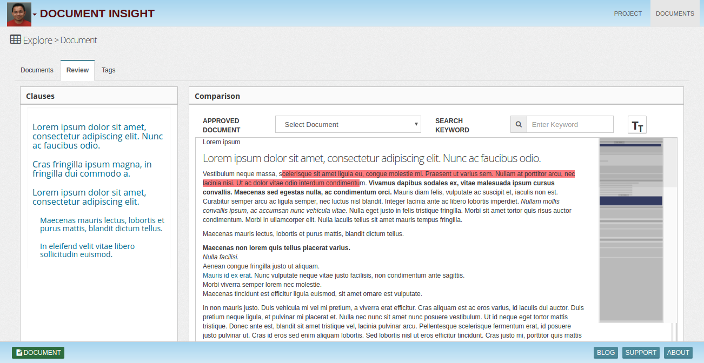
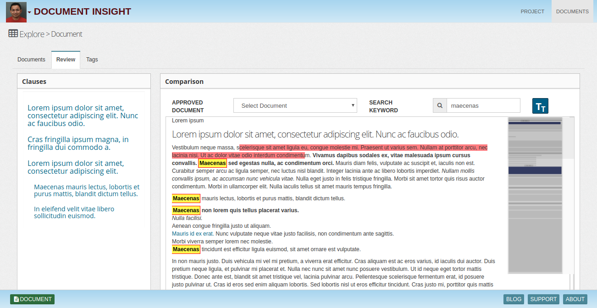
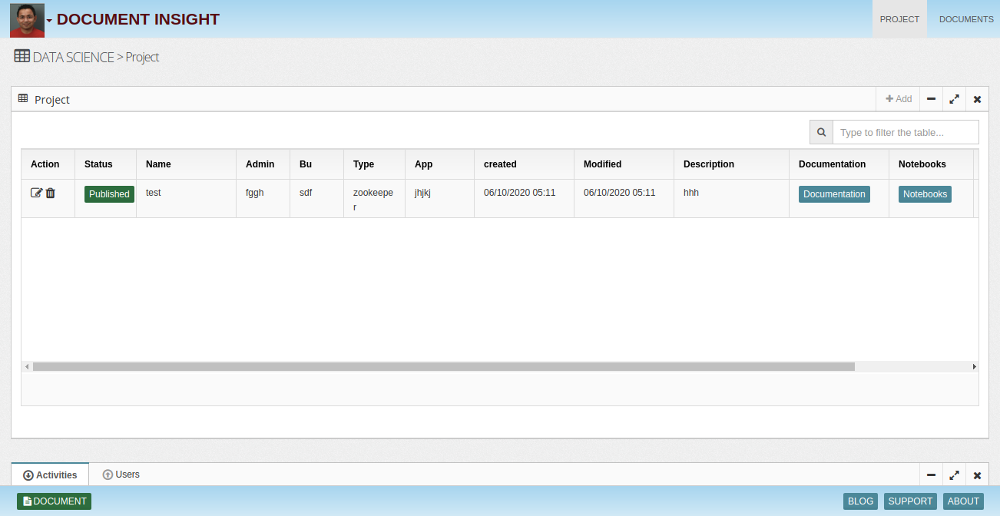
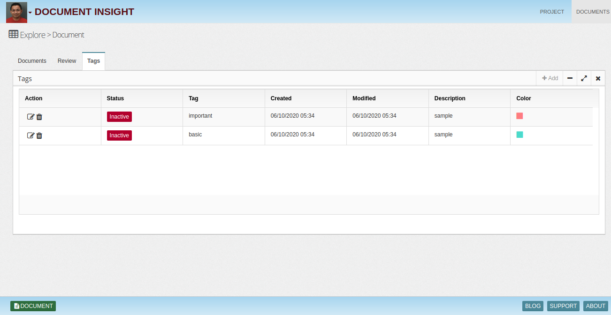

## Document-Insights

 Insight Lake's Document generation solution aims to help companies achieve their document generation goals
 very easily with rich functionality.

* Documents list & HTML View

* RAW Data View

* Document Search

* Document Review

* Text Highligting

* Project

* Tags

To learn more, check out [http://insightlake.com/dataexplorer.html](http://insightlake.com/dataexplorer.html)

Installation
------
* Download or clone the repository. 
* Run bin/insightlake command.
* Open browser with URL as http://localhost:8080/
* Change configuration in /conf folder to set different ports
* By default H2 database is used, you can change the database details in jdbc.properties file

License
------
InsightLake Data Explorer is a commercial product but distributed to be used freely. Please contact contact@insightlake.com for details.

Getting Help
----------

You can get help easily :
Community - Google Groups
Slack Channel
Twitter
Facebook
Email: contact@insightlake.com
